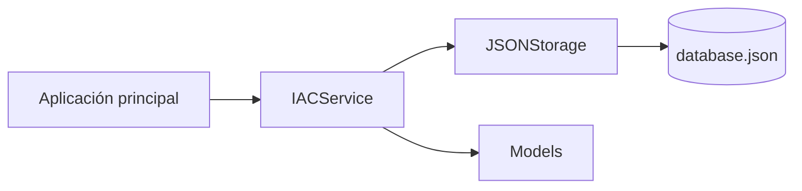
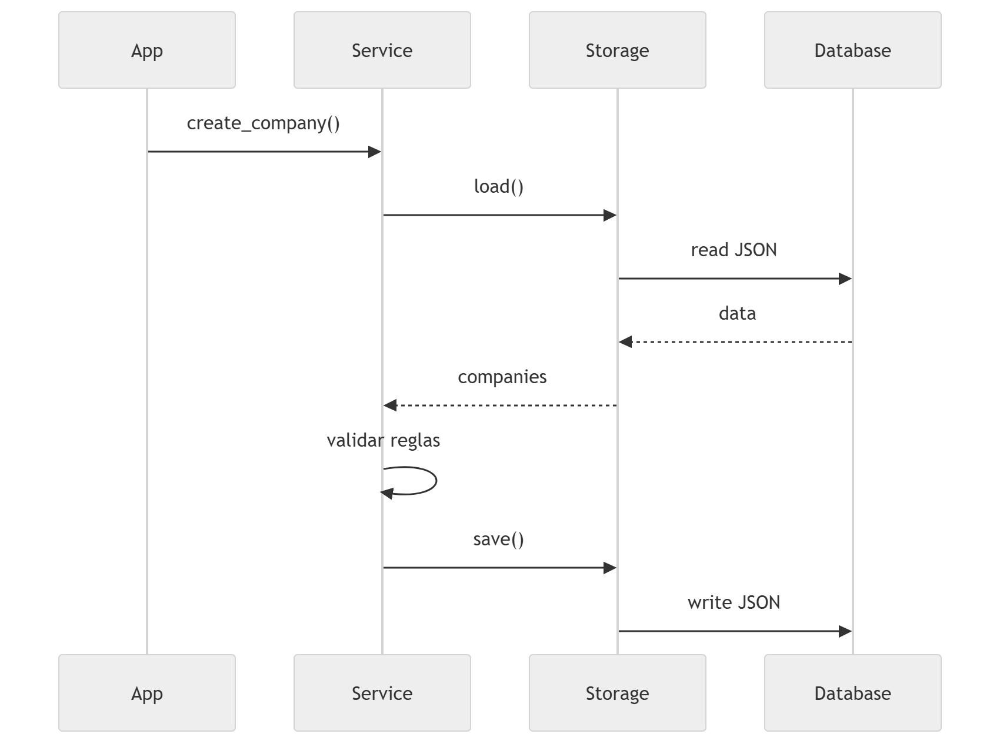

# IAC - Sistema de Gestión de Empresas

Bienvenido a la documentación oficial del proyecto **IAC**.

Este proyecto consiste en una aplicación desarrollada en **Python** que permite
gestionar empresas, productos y servicios utilizando una arquitectura modular.

El sistema implementa operaciones **CRUD** para administrar la información
almacenada en un archivo **JSON**, aplicando buenas prácticas de organización
del código y manejo de errores.

---

## ✨ Características

- Gestión de **empresas**
- Gestión de **productos**
- Gestión de **servicios**
- Persistencia de datos en **archivo JSON**
- Arquitectura modular (`src layout`)
- Manejo de **excepciones personalizadas**
- Pruebas unitarias con **pytest**
- Documentación generada automáticamente con **MkDocs**

---

## 🧠 Conceptos que se aplican en este proyecto

!!! info "Conceptos clave"

    - Arquitectura modular
    - Separación de responsabilidades
    - Manejo de excepciones personalizadas
    - Persistencia de datos con JSON
    - Testing con pytest
    - Documentación automática con MkDocs

---

## 📦 Arquitectura del sistema

El proyecto sigue una arquitectura simple por capas.




## 📁 Estructura del proyecto

``` bash
IAC/
│
├── data/
│   └── database.json
│
├── docs/
│   ├── commands/
│   │   └── comandos.md
│   ├── referencia/
│   │   └── api.md
│   ├── index.md
│   └── readme.md
│
├── src/
│   └── iac/
│       ├── __init__.py
│       ├── exceptions.py
│       ├── models.py
│       ├── services.py
│       └── storage.py
│
├── tests/
│   └── test_iac_service.py
│
├── main.py
├── mkdocs.yml
├── pyproject.toml
└── uv.lock
```

## 🚀 Flujo general del sistema

El funcionamiento del sistema sigue el siguiente flujo



## 📚 Documentación

La documentación del proyecto está dividida en varias secciones:

| Sección | Descripción |
|--------|-------------|
| Inicio | Explicación general del proyecto |
| README | Información general del repositorio y propósito del proyecto |
| Commands | Explicación de los comandos disponibles en la aplicación |
| Referencia técnica | Documentación automática del código (clases, métodos y excepciones) |

